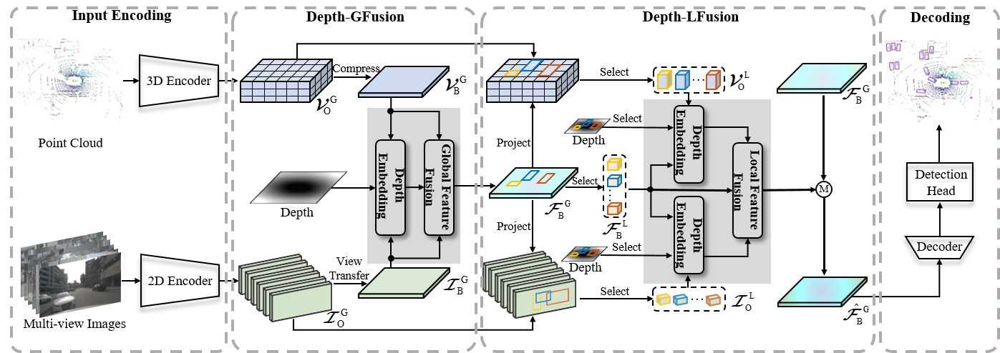

# DepthFusion: Depth-Aware Hybrid Feature Fusion for LiDAR-Camera 3D Object Detection

<div align="center">

[Mingqian Ji](https://github.com/Mingqj) </sup>,
[Jian Yang](https://scholar.google.com/citations?user=6CIDtZQAAAAJ&hl=zh-CN) </sup>,
[Shanshan Zhang](https://shanshanzhang.github.io/) ✉</sup>

Nanjing University of Science and Technology

✉ Corresponding author

</div>

## About

This repository represents the official implementation of the paper titled "DepthFusion: Depth-Aware Hybrid Feature Fusion for LiDAR-Camera 3D Object Detection".

We propose a novel depth encoding strategy to guide multi-modal fusion in 3D object detection. By encoding depth, our method adaptively adjusts the modality weights at both the global and local feature levels, enabling more effective LiDAR-camera fusion across varying depth ranges.



## Updates
- [2025.05.06] - Released the code and model weights for DepthFusion.
- [2025.02.24] - Submitted DepthFusion to IEEE Transactions on Multimedia (TMM).

## Main Results
### Nuscenes Detection
| Config                                                            | mAP  | NDS  | Backbone |    Image size    | Latency | FPS  | Model|
|:-----------------------------------------------------------------:|:----:|:----:|:--------:|:----------------:|:-------:|:----:|:----:|
| [**DepthFusion-Light**](configs/depthfusion/depthfusion-tiny.py)  | 69.8 | 73.3 | ResNet18 | 256 $\times$ 704 |  72.4  | 13.8 | [GoogleDrive](https://drive.google.com/file/d/1tLPTtFenoG6ubWuVmqJFsBJBXMAFfUjp/view?usp=drive_link) | 
| [**DepthFusion-Base**](configs/depthfusion/depthfusion-base.py)   | 71.2 | 74.0 | ResNet50 | 320 $\times$ 800 | 114.9  | 8.7 | [GoogleDrive](https://drive.google.com/file/d/1DLxeJmnL9jLbAjbHzYHEJADUv9PX1Tjz/view?usp=drive_link) |
| [**DepthFusion-Large**](configs/depthfusion/depthfusion-large.py) | 72.3 | 74.4 | SwinTiny | 384 $\times$ 1056 | 175.4 | 5.7 | [GoogleDrive](https://drive.google.com/file/d/1Nw4Fp78uVPG1wGwaKhGk133pXifal6vH/view?usp=drive_link) |

## Get Started

#### Installation and Data Preparation

step 1. Please prepare environment as that in [Docker](docker/Dockerfile) and run:
```shell
pip install -r requirements.txt
```

We use the following main environment:
```shell
torch                     1.10.0+cu111             
torchvision               0.10.0+rocm4.1
mmcls                     0.25.0                   
mmcv-full                 1.5.3                    
mmdet                     2.25.1                   
mmdet3d                   1.0.0rc4                 
mmsegmentation            0.25.0                                       
```

step 2. Prepare DepthFusion repo by running:
```shell script
git clone https://github.com/Mingqj/DepthFusion.git
cd DepthFusion
pip install -v -e .
```

step 3. Prepare nuScenes dataset and create the pkl for DepthFusion by running:
```shell
python tools/create_data_bevdet.py
```
step 4. Arrange the folder as:
```shell script
└──DepthFusion
    └──data
        └── nuscenes
            ├── v1.0-trainval
            ├── sweeps 
            ├── samples
            └── gts
```

#### Train DepthFusion model
```shell
# single gpu
python tools/train.py /configs/depthfusion/depthfuison-light.py # light version
python tools/train.py /configs/depthfusion/depthfuison-base.py # base version
python tools/train.py /configs/depthfusion/depthfuison-large.py # large version
# multiple gpu
./tools/dist_train.sh /configs/depthfusion/depthfuison-light.py 8 # light version
./tools/dist_train.sh /configs/depthfusion/depthfuison-base.py 8 # base version
./tools/dist_train.sh /configs/depthfusion/depthfuison-large.py 8 # large version

```

#### Test DepthFusion model
```shell
# single gpu
python tools/test.py /configs/depthfusion/depthfuison-light.py $checkpoint --eval mAP # light version
python tools/test.py /configs/depthfusion/depthfuison-base.py $checkpoint --eval mAP # base version
python tools/test.py /configs/depthfusion/depthfuison-large.py $checkpoint --eval mAP # large version
# multiple gpu
./tools/dist_test.sh /configs/depthfusion/depthfuison-light.py $checkpoint 8 --eval mAP # light version
./tools/dist_test.sh /configs/depthfusion/depthfuison-base.py $checkpoint 8 --eval mAP # base version
./tools/dist_test.sh /configs/depthfusion/depthfuison-large.py $checkpoint 8 --eval mAP # large version
```

#### Visualize the predicted result.
```shell
# light version
python tools/test.py /configs/depthfusion/depthfuison-light.py $checkpoint --format-only --eval-options jsonfile_prefix=$savepath
python tools/analysis_tools/vis.py $savepath/pts_bbox/results_nusc.json
# base version
python tools/test.py /configs/depthfusion/depthfuison-base.py $checkpoint --format-only --eval-options jsonfile_prefix=$savepath
python tools/analysis_tools/vis.py $savepath/pts_bbox/results_nusc.json
# large version
python tools/test.py /configs/depthfusion/depthfuison-large.py $checkpoint --format-only --eval-options jsonfile_prefix=$savepath
python tools/analysis_tools/vis.py $savepath/pts_bbox/results_nusc.json
```

## Acknowledgement

This project is not possible without multiple great open-sourced code bases. We list some notable examples below.

- [open-mmlab](https://github.com/open-mmlab)
- [BEVDet](https://github.com/HuangJunJie2017/BEVDet)
- [CenterPoint](https://github.com/tianweiy/CenterPoint)
- [Lift-Splat-Shoot](https://github.com/nv-tlabs/lift-splat-shoot)
- [Swin Transformer](https://github.com/microsoft/Swin-Transformer)
- [BEVFusion](https://github.com/mit-han-lab/bevfusion)
- [BEVDepth](https://github.com/Megvii-BaseDetection/BEVDepth)
- [nuScenes-C](https://opendatalab.com/OpenDataLab/nuScenes-C)
